# Laporan Proyek Machine Learning - Maklon Jacob Frare

## Domain Proyek

Kinerja siswa dalam lingkungan pendidikan memainkan peran penting dalam menentukan keberhasilan akademik dan masa depan mereka. Dalam era digital saat ini, institusi pendidikan memiliki akses ke berbagai data terkait aktivitas belajar siswa, seperti nilai ujian, kehadiran, partisipasi dalam kegiatan ekstrakurikuler, dan data demografis. Namun, potensi data ini seringkali belum dimanfaatkan secara maksimal untuk memberikan wawasan yang dapat membantu meningkatkan hasil belajar siswa.

Pendekatan tradisional dalam mengevaluasi kinerja siswa cenderung bersifat reaktif, hanya memberikan perhatian setelah masalah terjadi, seperti penurunan nilai atau tingkat kehadiran yang rendah. Oleh karena itu, diperlukan solusi yang bersifat prediktif untuk mengidentifikasi potensi risiko lebih awal, sehingga institusi pendidikan dapat mengambil langkah-langkah preventif untuk mendukung siswa secara proaktif.

Predictive analytics memungkinkan institusi pendidikan untuk mengidentifikasi pola performa siswa berdasarkan data historis. Teknologi ini membantu dalam pengambilan keputusan yang proaktif untuk memberikan intervensi yang tepat waktu dan mendukung siswa dalam mencapai hasil terbaik. Pada kasus ini penulis menerapkan 4 model pembelajaran machine learning yakni Random Forest, K-Nearest-Neighboars (KNN), Support Vector Machine (SVM) dan Extreme Gradient Boosting (XGBoost). Pendekatan ini mengintegrasikan keunggulan dari berbagai model untuk membandingkan dan menemukan algoritma terbaik dalam memprediksi performa siswa berdasarkan dataset yang diperoleh dari kaggel dan dapat diakses pada link [berikut](https://www.kaggle.com/datasets/rabieelkharoua/students-performance-dataset). Dengan menggunakan model ini, diharapkan hasil prediksi yang akurat dapat membantu institusi pendidikan dalam merancang strategi pembelajaran yang lebih efektif dan personalisasi untuk siswa.

## Business Understanding

### Problem Statements
Berdasarkan latar belakang tersebut, maka rincian permasalahan yang dapat dibahas pada proyek ini yakni:
1. Berapa banyak waktu belajar mingguan (*Study Time Weekly*) yang optimal untuk meningkatkan GPA siswa?
2. Apakah absensi siswa (*Absences*) berkorelasi negatif dengan GPA mereka?
3. Apakah tutoring (bimbingan belajar) memengaruhi GPA siswa?
4. Apakah terdapat perbedaan performa akademik antara siswa laki-laki dan perempuan (*Gender*) dalam hal GPA?
5. Bagaimana partisipasi siswa dalam kegiatan ekstrakurikuler (*Extracurricular, Sports, Music, Volunteering*) memengaruhi GPA mereka?
6. Apakah dukungan orang tua (*Parental Support*) berhubungan langsung dengan GPA siswa?
7. Faktor mana yang paling berpengaruh terhadap prediksi GPA siswa ketika mempertimbangkan semua atribut (*Age, Gender, Parental Education, Study Time Weekly, Absences, Tutoring, Parental Support, Extracurricular, Sports, Music, Volunteering*)
8. Apa model terbaik yang dapat digunakan untuk memprediksi kinerja siswa?

### Goals
Berdasarkan problem statements, berikut tujuan yang ingin dicapai pada proyek ini.
1. Menampilkan durasi belajar yang lebih efektif.
2. Mendeteksi pola absensi yang berdampak pada penurunan performa akademik.
3. Menilai pengaruh bimbingan belajar untuk meningkatkan performa siswa.
4. Mengidentifikasi apakah ada kesenjangan gender dalam pencapaian akademik.
5. Menilai dampak kegiatan non-akademik terhadap kinerja akademik.
6. Mengukur pentingnya keterlibatan orang tua dalam keberhasilan belajar siswa.
7. Membangun model prediksi untuk memantau dan meningkatkan kinerja siswa
8. Menemukan model terbaik berdasarkan akurasi tertinggi untuk memprediksi kinerja siswa.

### Solution Statement
1. Melakukan proses *Exploratory Data Analysis* (EDA) untuk menampilkan durasi belajar yang lebih efektif, mendeteksi pola absensi yang berdampak pada penurunan performa akademik, menilai efektivitas bimbingan belajar untuk meningkatkan performa siswa, mengidentifikasi apakah ada kesenjangan gender dalam pencapaian akademik, menilai dampak kegiatan non-akademik terhadap kinerja akademik, mengukur pentingnya keterlibatan orang tua dalam keberhasilan belajar siswa, membangun model prediksi untuk memantau dan meningkatkan kinerja siswa, memahami sinergi antara bimbingan belajar dan durasi belajar mandiri, menemukan model terbaik berdasarkan akurasi tertinggi untuk memprediksi kinerja siswa.
2. Menggunakan 4 model *machine learning* yaitu *Extreme Gradient Boosting* (XGBoost), *Support Vector Machine* (SVM), *Decision Tree* (Tree), dan *Random Forest* untuk memprediksi kinerja siswa
3. Menggunakan confusion matrix dan f1 score pada masing-masing model *machine learning* untuk menemukan model terbaik berdasarkan akurasi tertinggi.

## Data Understanding
Dataset yang digunakan untuk mempredisksi kinerja siswa diambil dari platform [kaggle](https://www.kaggle.com/) yang dipublikasikan oleh Rabie El Kharoua pada tanggal 13 Juni 2024. Kumpulan data ini berisi informasi lengkap tentang 2.392 siswa sekolah menengah, yang merinci demografi, kebiasaan belajar, keterlibatan orang tua, kegiatan ekstrakurikuler, dan prestasi akademik mereka. Variabel target, GradeClass, mengklasifikasikan nilai siswa ke dalam kategori yang berbeda, sehingga menyediakan kumpulan data yang kuat untuk penelitian pendidikan, pemodelan prediktif, dan analisis statistik. Dataset ini terdiri dari 1 file csv. 

### Informasi Keterangan Variabel pada Data
Dataset ini memiliki 15 variabel dengan keterangan sebagai berikut.
Variabel | Keterangan
----------|----------
StudentID | Pengidentifikasi unik yang diberikan kepada setiap siswa (1001 hingga 3392)
Age | Usia siswa berkisar antara 15 hingga 18 tahun
Gender | Jenis kelamin siswa, di mana 0 mewakili Laki-laki dan 1 mewakili Perempuan
Ethnicity | Etnis siswa, dikodekan sebagai berikut: 0(Kaukasia), 1(Afrika Amerika), 2(Asia), 3(Lainnya)
ParentalEducation | Tingkat pendidikan orang tua, dikodekan sebagai berikut: 0(Tidak Ada), 1(Sekolah Menengah Atas), 2(Beberapa Perguruan Tinggi), 3(Sarjana), 4(Lebih Tinggi)
StudyTimeWeekly | Waktu belajar mingguan dalam jam, berkisar antara 0 hingga 20
Absences | Jumlah ketidakhadiran selama tahun ajaran, berkisar antara 0 hingga 30
Tutoring | Status bimbingan belajar, di mana 0 menunjukkan Tidak dan 1 menunjukkan Ya
ParentalSupport | Tingkat dukungan orang tua, dikodekan sebagai berikut: 0(Tidak Ada), 1(Rendah), 2(Sedang), 3(Tinggi), 4(Sangat Tinggi)
Extracurricular | Partisipasi dalam kegiatan ekstrakurikuler, di mana 0 menunjukkan Tidak dan 1 menunjukkan Ya
Sports | Partisipasi dalam olahraga, di mana 0 menunjukkan Tidak dan 1 menunjukkan Ya
Music	| Partisipasi dalam kegiatan musik, di mana 0 menunjukkan Tidak dan 1 menunjukkan Ya
Volunteering	| Partisipasi dalam kesukarelaan, di mana 0 menunjukkan Tidak dan 1 menunjukkan Ya
GPA	| Nilai Rata-rata Poin pada skala 2,0 hingga 4,0
GradeClass | Klasifikasi nilai siswa berdasarkan IPK (0: 'A' (IPK >= 3,5)), (1: 'B' (3,0 <= IPK < 3,5)), (2: 'C' (2,5 <= IPK < 3,0)), (3: 'D' (2,0 <= IPK < 2,5)), (4: 'F' (IPK < 2,0))

### Data Cleaning
Setelah diperiksa apakah terdapat kolom yang bernilai null, hasilnya adalah tidak ada. Sedangkan data duplikat atau data ganda juga tidak ada. Maka dengan demikian data siapa untuk dianalisis pada tahap selanjutnya.

Selanjutnya kita akan melihat pesebaran data pada kolom nuerikal pada gambar dibawah ini:

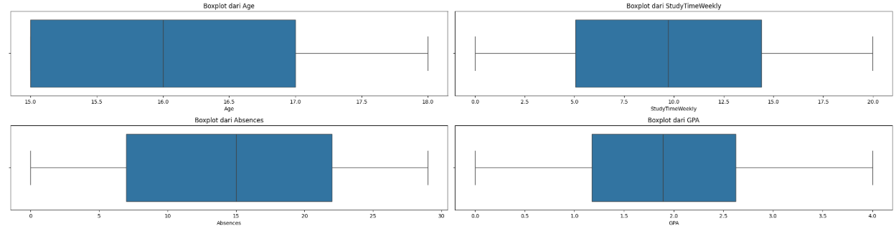  
Interprestasi:
1. Pada kolom Age, dapat dilihat rata-rata siswa berumur 15-17 tahun. Dapat disimpulkan tidak ada Outlier yang tersebar.
2. Pada kolom StudyTimeWeekly, dapat dilihat bahwa rata-rata siswa memiliki waktu belajar 5-14 jam per minggu.
3. Pada kolom absences, dapat dilihat bahwa rata-rata siswa memiliki jumlah ketidakhadiran 6 - 23 hari. Dapat disimpulkan 1. Pada kolom
4. Pada kolom GPA, dapat dilihat bahwa rata-rata prestasi siswa diantara 1,2 - 2,7 dan tidak memiliki outlier.

### Univariate Analysis

Dari variabel-variabel yang diketahui, variabel dapat dibagi menjadi 2 jenis, yaitu variabel numerikal dan variabel kategorikal. Berikut merupakan kolom-kolom yang termasuk dalam variabel numerikal maupun kategorikal.  
Semua numerikal: ["Age", "StudyTimeWeekly", "Absences", "GPA"]  
Semua kategorikal: ["Gender", "Ethnicity", "ParentalEducation", "Tutoring", "ParentalSupport", "Extracurricular", "Sports", "Music", "Volunteering", "GradeClass"]

Pertama, kita akan melihat nilai berbeda pada kolom kategorikal pada gambar tabel dibawah ini:

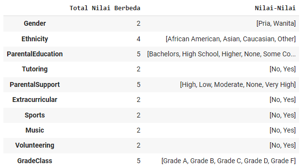  
Dapat dilihat pada tabel nilai berbeda pada:
1. Kolom gender = 2;
2. Kolom Etnicity = 4;
3. Kolom ParentalEducation = 5;
4. Kolom Tutoring = 2;
5. Kolom ParentalSupport = 5;
6. Kolom Extracurricular = 2;
7. Kolom Sports = 2;
8. Kolom Music = 2;
9. Kolom Volunteering = 2;
10. Kolom GradeClass(Variabel Target) = 5;
    
Kedua, kita akan memvisualisasikan kolom-kolom kategorikal untuk melihat jumlah-jumlah nilai kategorikal menggunakan bar plot.

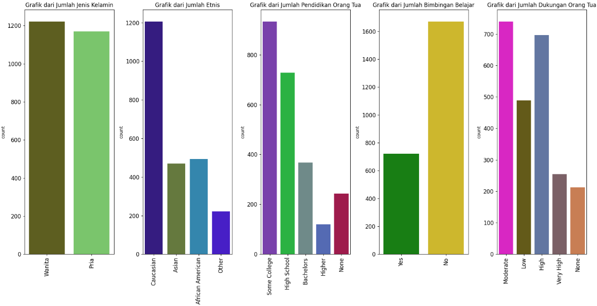  
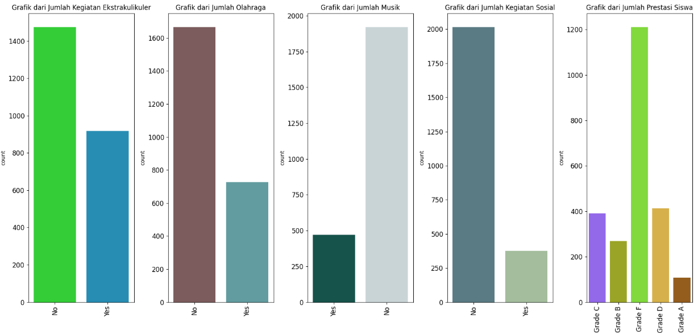  

Interpretasi:
1. Grafik jenis kelamin, menunjukan jumlah merata antara laki-laki dan perempuan.
2. Grafik Etnis, menunjukan mayoritas siswa berasal dari etnis kaukasia.
3. Grafisk pendidikan orangtua, menunjukan mayoritas pendidikan orang tua yakni pensisikan tinggi dan sarjana
4. Grafik bimbingan belajar, menunjukan mayoritas siswa tidak mengikuti bimbingan belajar.
5. Grafik dukungan orang tua, menunjukan mayoritas dukungan orang tua berada di level sdang dan tinggi.
6. Grafik Ekstrakulikuler(EKtrakulikuler, Olahraga, Musik dan Sukrelawan), menujukan rendahnya minat siswa pada kegiatan diluar sekolah.

Ketiga, kita akan melihat lebih detail mengenai jumlah dari masing-masing tingkat kelas terbaik yang menjadi target kita untuk mengetahui jumlah secara umum.

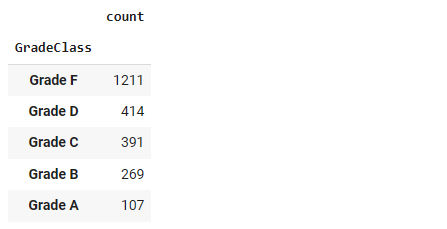  

Interpretasi: 
Kelas terbaik(GradeClass) yang ditampilkan menununjukan mayoritas prestasi siswa berada di kategori Grade F (Prestasi terendah)

Keempat, kita buat pie chart untuk melihat persebaran data dari masing-masing Prestasi Siswa Pada Kategori GradeClass:

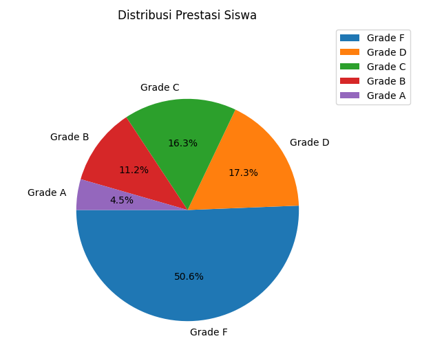  
Interpretasi:
Siswa berada pada gradeclass F (Prestasi terendah) memiliki presntasi terbayak yakni 50% keatas.

Langkah terakhir, kita akan membentuk histogram dari variabel-variabel numerikal untuk melihat persebaran data:

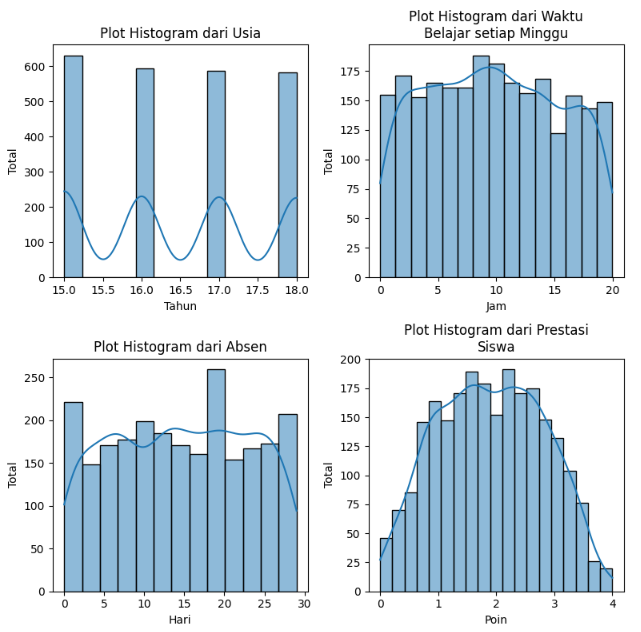  
Interpretasi: 
Usia, waktu belajar setiap minggu, absen dan nilai siswa cukup berdistribusi normal.

### Multivariate Analysis

#### 1. Membandingkan waktu belajar mingguan dengan prestasi siswa

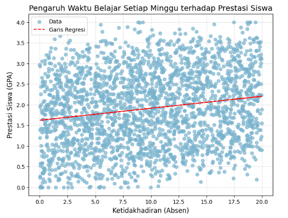  

Interpretasi:
Siswa yang waktu belajaranya banyak mempengaruhi naiknya prestasi belajar(GPA).

#### 2. Membandingkan Ketidakhadiran(Absen) dengan Nilai Prestasi Siswa

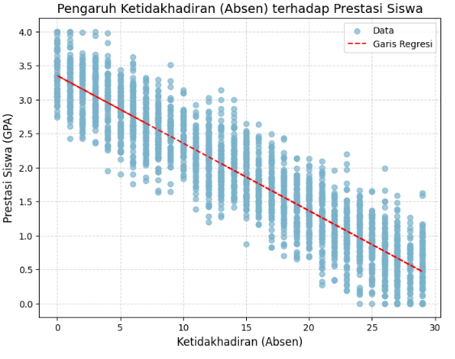  

Interpretasi:
Absen(ketidakhadiran) siswa sangat mempengaruhi turun prestasinya(GPA).

#### 3. Membandingkan Bimbingan Belajar dengan Nilai Prestasi Siswa

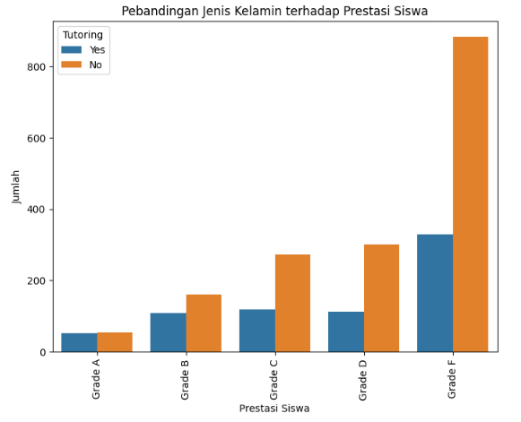  

Interpretasi:
Banyak siswa yang tidak mengikuti bimbingan belajar yang mendapat prestasi rendah (Grade F)

#### 4. Membandingkan Jenis Kelamin Pada Nilai Prestasi Siswa

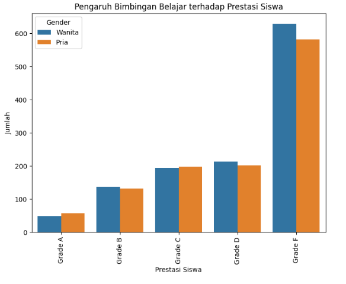  

Interpretasi:
Jenis kelamin pria lebih dominan memiliki prestasi lebih tinggi dibandingkan dengan wanita

#### 5. Membandingkan Kegiatan Ekskulikuler dengan Nilai Prestasi Siswa

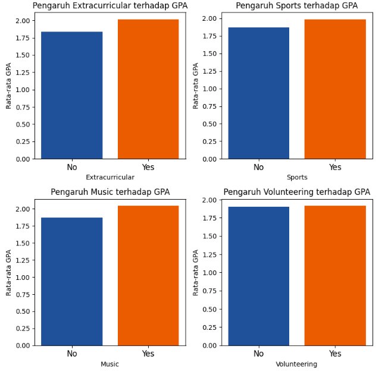  

Interpretasi:
Lebih banyak siswa yang tidak mengikuti kegiatan ekstrakulikuler, olahraga dan musik mempengaruhi turunya nilai pretasi(GPA) mereka

#### 6. Membandingkan Dukungan Orang Tua dengan Nilai Prestasi Siswa

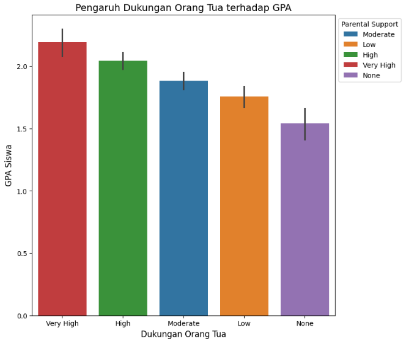  

Interpretasi:
Mayoritas dukungan orang tua sangat mempengaruhin nilai prestasi siswa (GPA). Semakin tinggi dukungan orang tua, maka semakin meningkat nilai prestasi dari anaknya.

#### 7. Melihat Korelasi Variabel dengan Menggunakan Heatmap

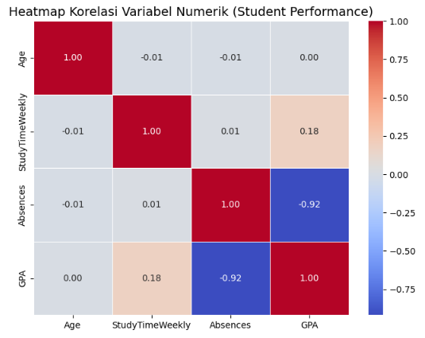  

Interpretasi:

Nilai Prestasi Siswa memiliki
1. Korelasi negatif yang cukup kuat dengan ketidakhadiran(Absences).
2. Korelasi positif yang cukup lemah dengan waktu belajar setiap minggu(StudyTimeWeekly).

#### 8. Melihat Plot Scatter yang Memiliki Nilai Korelasi Positif dan Negatif

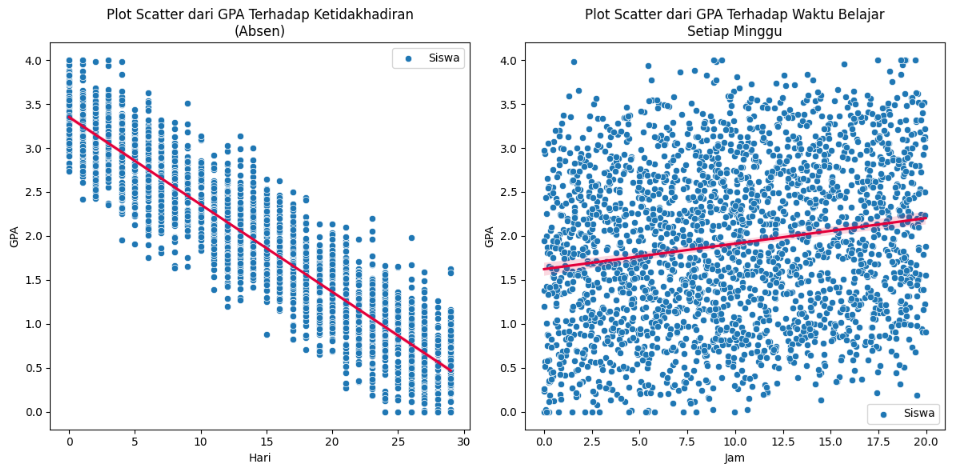  

Interpretasi:

Nilai prestasi siswa (GPA) memiliki  korelasi negatif yang kuat pada ketidakhadiran (garis regresi menurun ke kanan bawah) dan korelatif positif cukup lemah pada waktu belajar setiap minggu (garis regresi naik ke kanan atas)

## Data Preprocessing
Pada bagian ini, kita akan mengubah data mentah menjadi bentuk yang lebih mudah dipahami yang iasa disebut data Preprocesing. 

### Train-Test-Split
Langkah awal kita mengubah data objek ke data numeri dengan memanggil fungsi konversi objek to numerik. Selanjutnya, karena target kita adalah variabel GradeClass untuk mengetahui akurasi prediksi dari kategori kelas prestasi terbaik, maka kita akan membuang kolom tersebut dari data dan assign kolom tersebut ke variabel baru.Data training digunakan untuk melatih model dengan data yang ada, sedangkan data testing digunakan untuk menguji model yang dibuat menggunakan data yang belum dilatih. Pembagian data ini dilakukan dengan perbandingan 80% : 20% untuk data training dan data testing menggunakan train_test_split dari library sklearn. Berikut adalah data traning yang akan diproses (ditampilkan contoh 5 baris teratas):

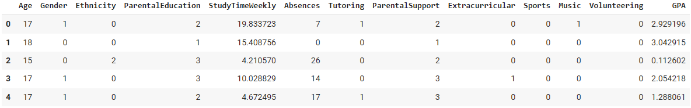  

### Standarisasi
Pada langkah ini, kita akan melakukan normalisasi dengan fungsi StandardScaler untuk mengubah data numerik ke skala standar (mean=0, std=1).  Ini dilakukan untuk menyamakan skala variabel yang memiliki unit yang berbeda, sehingga memudahkan analisis dan perbandingan.

## Model Development

Pada bagian ini, kita akan membangun 4 model machine learning untuk menguji sebarapa baik akurasi model, sehingga model tersebut yang disarankan untuk memprediksi prestasi siswa.

### 1. Model Development dengan Random Forest

Algoritma pembelajaran ensemble yang sangat populer untuk tugas klasifikasi dan regresi. Ini bekerja dengan membuat sejumlah pohon keputusan selama pelatihan dan menggabungkan hasilnya (melalui voting untuk klasifikasi atau rata-rata untuk regresi) untuk meningkatkan akurasi dan mengurangi overfitting..  

Pada pemodelan ini, *Random Forest* diimplementasikan menggunakan `RandomForestClassifier` dari library `sklearn.ensemble` dengan memasukkan `X_train` dan `y_train` untuk melatih model, lalu menggunakan `X_test` dan `y_test` untuk menguji model dengan data testing yang tidak ada di data training. Parameter yang digunakan pada model ini adalah `n_estimators` yaitu jumlah tree yang akan dibuat, `criterion` yaitu fungsi untuk menentukan kualitas *splitting data*, `max_depth` yaitu kedalaman maksimum setiap tree, dan `random_state` yaitu mengontrol seed acak yang diberikan pada setiap iterasi. Pada proyek ini, parameter yang digunakan adalah `n_estimators = 200`, `criterion = "entropy"`, `max_depth = 10`, `random_state = 50`.

### 2. Model Development dengan Extreme Gradient Boosting (XGBoost)

Algoritma Extreme Gradient Boosting merupakan salah satu algoritma boosting yang sangat kuat untuk tugas klasifikasi dan regresi. XGBoost dirancang untuk efisiensi, fleksibilitas, dan performa tinggi, serta sering digunakan dalam kompetisi machine learning.  

Pada pemodelan ini, XGBoost diimplementasikan menggunakan `XGBClassifier` dari library `xgboost` dengan memasukkan `X_train` dan `y_train` untuk melatih model, lalu menggunakan `X_test` dan `y_test` untuk menguji model dengan data testing yang tidak ada di data training. Parameter yang digunakan pada model ini adalah `max_depth` yaitu kedalaman maksimum setiap tree, `n_estimators` yaitu jumlah tree yang akan dibuat, `random_state` yaitu mengontrol seed acak yang diberikan pada setiap iterasi, `learning rate` yaitu mengatur langkah setiap iterasi ketika meminimumkan *loss function*, dan `n_jobs` yaitu mengatur jumlah CPU threads untuk menjalankan XGBoost. Pada proyek ini, parameter yang digunakan adalah `max_depth = 10`, `n_estimators = 125`, `random_state = 30`, `learning_rate = 0.01`, `n_jobs = 20`.

### 3. Model Development dengan Support Vector Machine* (SVM)

Algoritman ini sangat efektif untuk klasifikasi dan regresi. SVM bekerja dengan mencari hyperplane optimal yang memisahkan data dalam ruang fitur, serta mendukung kernel untuk menangani data non-linear.  

Pada pemodelan ini, SVM diimplementasikan menggunakan `SVC` dari library `sklearn.svm` dengan memasukkan `X_train` dan `y_train` untuk melatih model, lalu menggunakan `X_test` dan `y_test` untuk menguji model dengan data testing yang tidak ada di data training. Parameter yang digunakan pada model ini adalah `kernel` yaitu tipe kernel yang digunakan untuk mentransformasikan input data, `gamma` yaitu pengaruh dari sebuah contoh training, dan `random_state` yaitu mengontrol seed acak yang diberikan pada setiap iterasi. Pada proyek ini, parameter yang digunakan adalah `kernel = 'rbf'`, `gamma = 'auto'`, `random_state = 50`.

### 4. Model Development dengan Naive Bayes

Algoritman ini merupakan algoritma klasifikasi berbasis probabilistik yang didasarkan pada Teorema Bayes. Algoritma ini bekerja dengan asumsi bahwa semua fitur saling independen (meskipun dalam kenyataan sering tidak sepenuhnya demikian).  

Pada pemodelan ini, Naive Bayes diimplementasikan menggunakan `GaussianNB` dari library `sklearn.naive_bayes` karena datanya numerik dengan memasukkan `X_train` dan `y_train` untuk melatih model, lalu menggunakan `X_test` dan `y_test` untuk menguji model dengan data testing yang tidak ada di data training. 

### 5. Pemilihan Model

Setelah semua model dijalankan, penulis memilih algoritma *XGBoost* sebagai model terbaik yang akan digunakan sebagai solusi untuk memprediksi performa siswa karena model ini memiliki akurasi dan skor f1 tertinggi dibandingkan model lainnya, serta kesalahan klasifikasi pada matriks confusion yang lebih kecil dibanding model lainnya. Penjelasan lebih lengkap mengenai alasan ini ada di bagian selanjutnya, yaitu **evaluation**.

## Evaluation

Pada proyek ini, penilaian model menggunakan confusion matrix, akurasi, dan f1 score sebagai metrik evaluasi untuk masing-masing model. Akan dijelaskan terlebih dahulu bagaimana cara mendapatkan akurasi dan f1 score serta bagaimana cara menggunakan confusion matrix.

### Matriks Confusion, Akurasi, dan Skor f1

1. Matriks Confusion merupakan matriks yang menunjukkan jumlah prediksi benar dan salah untuk setiap kelas. Contoh dari Matriks Confusion beserta labelnya dapat dilihat pada gambar di bawah ini.

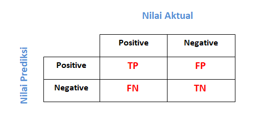  

Formatnya:
[[TP, FP],
 [FN, TN]]

Terdapat 4 label pada matriks confusion seperti yang terlihat di gambar, yaitu TP, TN, FP, dan FN.
    a. *True Positive* (TP) merupakan jumlah data pada positif yang ditebak dengan benar.
    b. *True Negative* (TN) merupakan jumlah data pada negatif yang ditebak dengan benar.
    c. *False Positive* (FP) merupakan jumlah data yang ditebak dengan salah karena diprediksi positif, sedangkan aslinya adalah negatif.
    d. *False Negative* (FN) merupakan jumlah data yang ditebak dengan salah karena diprediksi negatif, sedangkan aslinya adalah positif.
    
2. Akurasi merupakan Persentase prediksi benar terhadap total prediksi. 
Formatnya: 
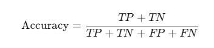

3. Skor F1 merupakan rata-rata harmonik dari precision dan recall.
Formatnya: 
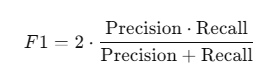

4. Precision merupakan proporsi prediksi positif yang benar-benar benar. 
Rumusnya:  
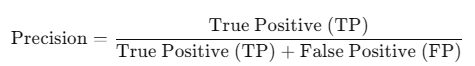  
*Contoh*: Jika model memprediksi 10 data sebagai positif, tetapi hanya 7 yang benar-benar positif, maka precision adalah 7/10 = 0.7.

5. Recall (Sensitivity) merupakan proporsi data positif yang terdeteksi dengan benar oleh model. 
Rumusnya:  
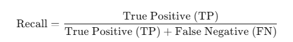  
*Contoh*: Jika model memprediksi 10 data sebagai positif, tetapi hanya 7 yang benar-benar positif, maka precision adalah 7/10 = 0.7.
 
### Penerapan Matriks Confusion, Akurasi, dan Skor f1

#### 1. Model Development dengan Random Forest

Berikut merupakan matriks confusion, akurasi, dan skor f1 dari model *Random Forest*

  

Dari gambar di atas, terdapat 11 data yang diprediksi salah pada Grade A dan 14 data yang diprediksi salah pada Grade F. Diperoleh skor F1 nya adalah 0.92 dengan akurasi tepatnya adalah 0.9207 atau ≈92.07%.

#### 2. Model Development dengan XGBoots

Berikut merupakan matriks confusion, akurasi, dan skor f1 dari model SVM

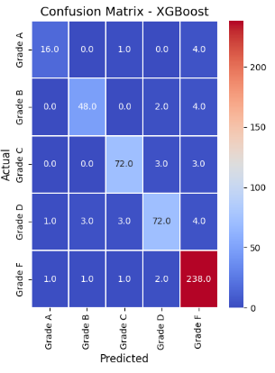  

Dari gambar di atas, terdapat 5 data yang diprediksi salah pada Grade A dan 15 data yang diprediksi salah pada Grade F. Diperoleh skor F1 nya adalah 0.93 dengan akurasi tepatnya adalah 0.9311 atau ≈93.11%.

#### 3. Model Model Development dengan SVM

Berikut merupakan matriks confusion, akurasi, dan skor f1 dari model KNN

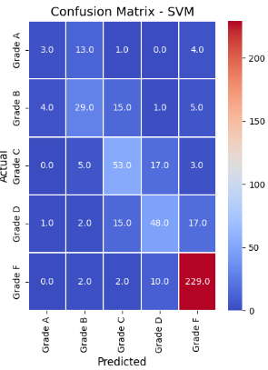  

Dari gambar di atas, terdapat 18 data yang diprediksi salah pada Grade A dan 29 data yang diprediksi salah pada Grade F. Diperoleh skor F1 nya adalah 0.74 dengan akurasi tepatnya adalah 0.7557 atau ≈75.57%.

#### 4. Model Model Development dengan Naive Bayes

Berikut merupakan matriks confusion, akurasi, dan skor f1 dari model KNN

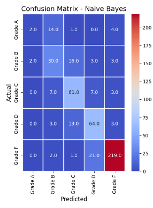  

Dari gambar di atas, terdapat 19 data yang diprediksi salah pada Grade A dan 24 data yang diprediksi salah pada Grade F. Diperoleh skor F1 nya adalah 0.74 dengan akurasi tepatnya adalah 0.7557 atau ≈75.57%.

#### Hasil Evaluasi
Dari seluruh akurasi yang diketahui dari keempat model, dibentuk bar plot untuk melihat perbandingan nilai akurasi model sebagai berikut. 

  

Berdasarkan gambar di atas dan evaluasi masing-masing model untuk mengetahui skor akurasi, skor F1, dan jumlah kesalahan klasifikasi pada masing-masing model, didapat model *XGBoots* merupakan model terbaik karena memiliki skor akurasi dan skor F1 tertinggi, serta jumlah kesalahan klasifikasi yang paling sedikit, terutama pada Grade A. 

## Kesimpulan
1. Berdasarkan data yang diperoleh, waktu belajar yang optimal berada ditas 20 jam. 
2. Berdasarkan data yang diperoleh, absen (ketidakhadiran) siswa sangat mempengaruhi turun prestasinya(GPA)
3. rata-rata siswa yang tidak mengikuti bimbingan belajar lebih banyak berada pada prestasi kelas bawah (Grade F)
4. Jenis kelamin yang berbeda memiliki prestasi yang tidak jauh berbeda. Dari data yang diperoleh, mayoritas perempuan mengalami penurunan prestasi pada Grade F, Grade D, Grade B dan Grade A dibandingkan dengan laki-laki.
5. Mayoritas siswa yang tidak mengikuti kegiatan ekstrakulikuler, olahraga dan musik mempengaruhi turunya nilai pretasinya(GPA)
6. Dukungan orang tua sangat mempengaruhin nilai prestasi siswa (GPA). Semakin tinggi dukungan orang tua, maka semakin meningkat nilai prestasi dari anaknya.
7. Setelah menguji data menggunakan 4 model *machine learning*, yaitu ***Extreme Gradient Boosting* (XGBoost)**, ***Support Vector Machine* (SVM)**, ***Naive Bayes**, dan ***Random Forest*** untuk memprediksi performa siswa, diperoleh model *XGBoost* merupakan model terbaik dibandingkan model lainnya berdasarkan skor akurasi, skor F1, dan jumlah kesalahan klasifikasi yang paling sedikit.

## Referensi
1. Abdul Rahman. "Klasifikasi Performa Akademik Siswa Menggunakan Metode Decision Tree dan Naive Bayes", Vol. 13 No.1 (2023) 22-31, ISSN 2503-3247. SINTA Peringkat 4, diakses pada 28 November 2024.
2. Dicoding. Diakses pada 6 Juli 2024 dari https://www.dicoding.com/academies/319-machine-learning-terapan
3. Arif Fahrudin1, Harco Leslie Hendric Spits Warnars. "Prediksi Performa Siswa Dengan Metode SAW", vol. 9, no. 1, 2020, P-ISSN 2089-1245, E-ISSN 2655-4925. KILAT, diakses pada 29 November 2024.
